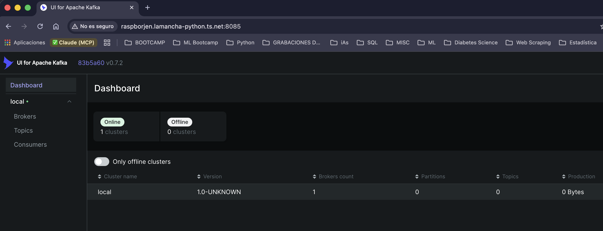
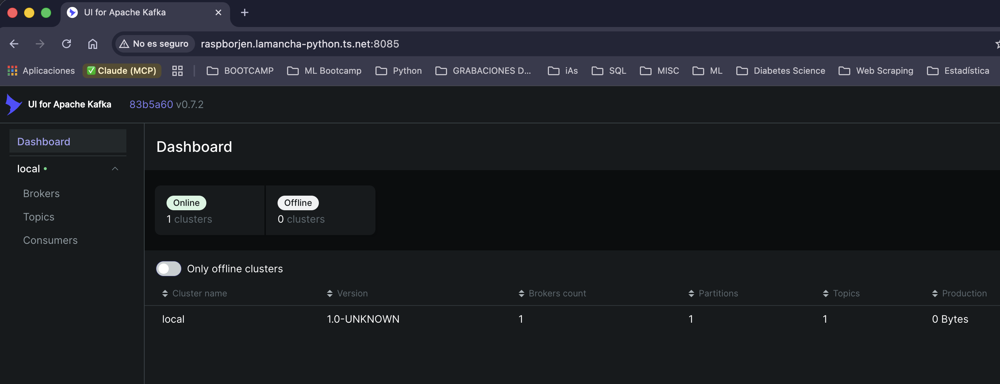
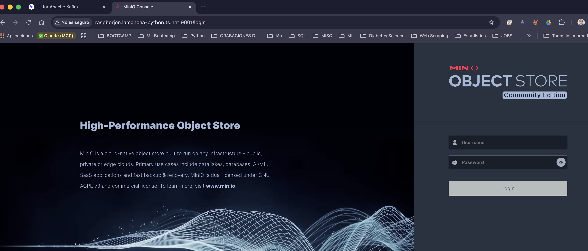
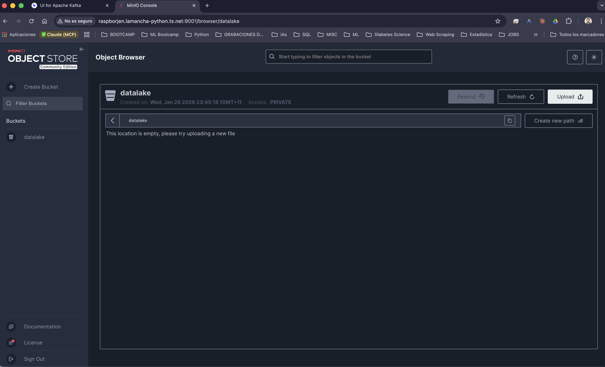
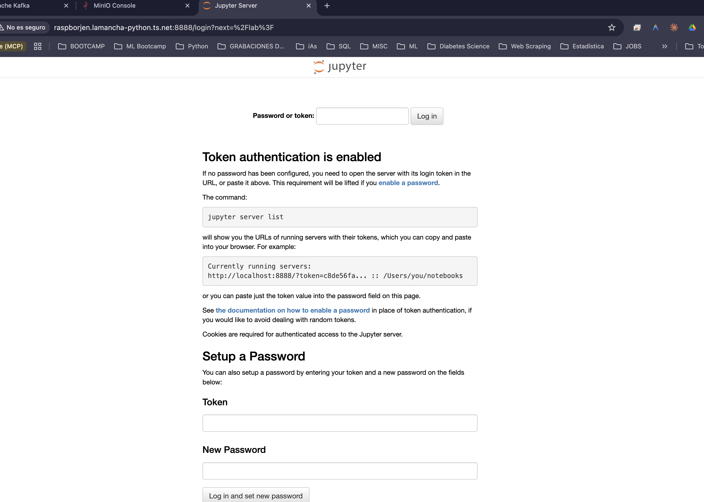
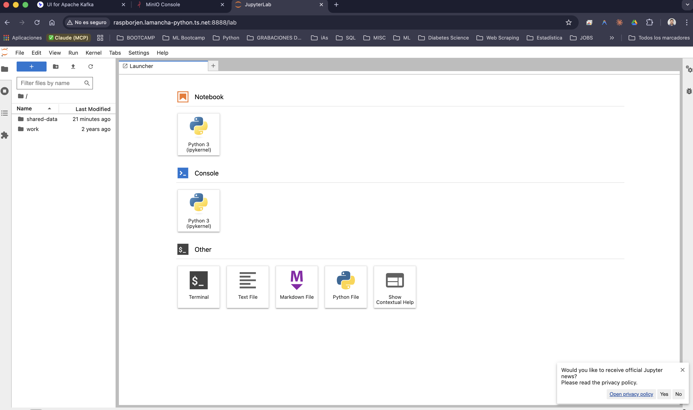
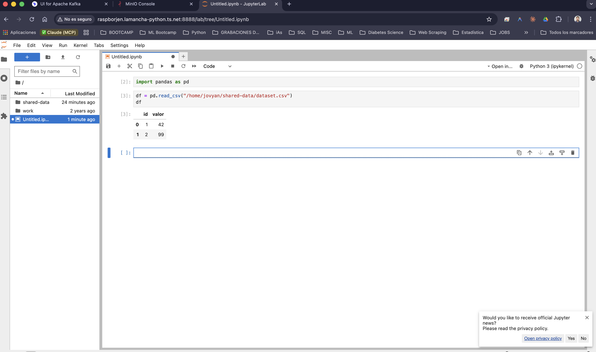

# BIG DATA APLICADO · RA2

<br><br>
> Reto 03 — Redes + Almacenamiento en Docker aplicado a Big Data
> por ***Borja Ramos Oliva***

<br><br>
<br><br>
---
<div class="page"></div>

```bash
$ cd /Alumno/BorjaRamosOliva
$ pwd
/Alumno/BorjaRamosOliva

$ date
Sun Feb  1 11:56:56 CET 2026


$ echo $ASIGNATURA
Big Data Aplicado (BDA)

$ uname -a
Ubuntu Server 24.04.3 LTS · Raspberry Pi

```
---

<br>
<!-- pagebreak -->

## BIG DATA APLICADO · RA2  
### RETO 03 — Redes + Almacenamiento en Docker aplicado a Big Data  
por ***Borja Ramos Oliva***

En este reto se trabaja la **configuración de redes Docker, servicios de ingesta,
almacenamiento tipo data lake y análisis de datos**, reproduciendo una arquitectura
simplificada de Big Data.

La práctica se ha realizado sobre **Ubuntu Server 24.04** en una **Raspberry Pi**
(nombre del equipo `raspborjen`), accediendo al sistema mediante terminal SSH.
Todas las evidencias incluyen **fecha y hora del sistema**, tal y como se solicita
en el enunciado.

---

### Preparamos el sistema

```bash
(base) borjen@McBrain ~ % ssh borjen@raspborjen
Welcome to Ubuntu 24.04.3 LTS (GNU/Linux 6.8.0-1044-raspi aarch64)
* Documentation:
* Management:
* Support:
https://help.ubuntu.com
https://landscape.canonical.com
https://ubuntu.com/pro
System information as of Wed Jan 28 23:17:07 CET 2026
System load:
0.09
Usage of /:
28.5% of 28.70GB
Memory usage:
14%
Swap usage:
0%
Temperature:
49.7 C
Processes:
176
Users logged in:
1
IPv4 address for eth0: 192.168.100.42
IPv6 address for etho: fde1:739e:a376:4cf5:2ecf:67ff:fe8b:5da
Expanded Security Maintenance for Applications is not enabled.
48 updates can be applied immediately.
To see these additional updates run: apt list --upgradable
Enable ESM Apps to receive additional future security updates.
See https://ubuntu.com/esm or run: sudo pro status
Last login: Wed Jan 28 23:10:42 2026 from 100.102.114.6
borjen@raspborjen:~$ date
Wed Jan 28 23:17:16 CET 2026
```
---
<!-- pagebreak -->

### Parte A — Redes Docker
  
Aquí se crean dos redes Docker de tipo *bridge* para separar responsabilidades:  
- **ingestnet** para la capa de ingesta (Kafka).  
- **datalakenet** para almacenamiento y analítica (MinIO y Jupyter).  
Esto replica una arquitectura Big Data real, donde cada capa está aislada a nivel de red.

```bash
borjen@raspborjen:~$ docker network create ingestnet
e5b1064a2a1e89e85eafa6f35e75cc12750568266ac63f05fa45babb74a3e6b0 

borjen@raspborjen:~$ docker network create datalakenet
4e0693107dc2f85643f676a2b920b88a9d23c6b06e57f4355a2555bc8df265ac

borjen@raspborjen:~$ docker network ls
NETWORK ID     NAME                               DRIVER    SCOPE
f35e6814d08e   bridge                             bridge    local
4e0693107dc2   datalakenet                        bridge    local
90fb039037d9   docker_gwbridge                    bridge    local
f8rx95yl0451   dokploy-network                    overlay   swarm
27033c328dcd   dokploy-trial-n8n-jgmzux_default   bridge    local
8fd9cab73fe7   host                               host      local
e5b1064a2a1e   ingestnet                          bridge    local
ghxswwba2dwj   ingress                           overlay   swarm
82ff431cf677   none                               null      local
```
### Inspeccionamos las redes
Mediante `docker network inspect` verificamos parámetros clave de cada red: subred, gateway y estado.  
Comprobamos que cada red tiene su propio rango IP, garantizando aislamiento entre ingesta y analítica:

```bash
borjen@raspborjen:~$ docker network inspect ingestnet
[
    {
        "Name": "ingestnet",
        "Id": "e5b1064a2a1e89e85eafa6f35e75cc12750568266ac63f05fa45babb74a3e6b0",
        "Created": "2026-01-28T23:17:27.726917182+01:00",
        "Scope": "local",
        "Driver": "bridge",
        "EnableIPv4": true,
        "EnableIPv6": false,
        "IPAM": {
            "Driver": "default",
            "Options": {},
            "Config": [
                {
                    "Subnet": "172.19.0.0/16",
                    "IPRange": "",
                    "Gateway": "172.19.0.1"
                }
            ]
        },
        "Internal": false,
        "Attachable": false,
        "Ingress": false,
        "ConfigFrom": {
            "Network": ""
        },
        "ConfigOnly": false,
        "Options": {},
        "Labels": {},
        "Containers": {},
        "Status": {
            "IPAM": {
                "Subnets": {
                    "172.19.0.0/16": {
                        "IPsInUse": 3,
                        "DynamicIPsAvailable": 65533
                    }
                }
            }
        }
    }
]

borjen@raspborjen:~$ docker network inspect datalakenet
[
    {
        "Name": "datalakenet",
        "Id": "4e0693107dc2f85643f676a2b920b88a9d23c6b06e57f4355a2555bc8df265ac",
        "Created": "2026-01-28T23:17:41.90129114+01:00",
        "Scope": "local",
        "Driver": "bridge",
        "EnableIPv4": true,
        "EnableIPv6": false,
        "IPAM": {
            "Driver": "default",
            "Options": {},
            "Config": [
                {
                    "Subnet": "172.21.0.0/16",
                    "IPRange": "",
                    "Gateway": "172.21.0.1"
                }
            ]
        },
        "Internal": false,
        "Attachable": false,
        "Ingress": false,
        "ConfigFrom": {
            "Network": ""
        },
        "ConfigOnly": false,
        "Options": {},
        "Labels": {},
        "Containers": {},
        "Status": {
            "IPAM": {
                "Subnets": {
                    "172.21.0.0/16": {
                        "IPsInUse": 3,
                        "DynamicIPsAvailable": 65533
                    }
                }
            }
        }
    }
]
```
<!-- pagebreak -->

### Parte B — Kafka (KRaft) + Kafka UI

Kafka se ejecuta en modo KRaft (sin ZooKeeper), utilizando un `CLUSTER_ID` único que identifica el clúster.
Este identificador es obligatorio en este modo, ya que permite inicializar y asociar el almacenamiento interno del broker al clúster Kafka, sustituyendo a ZooKeeper

```bash
borjen@raspborjen:~$ date
Wed Jan 28 23:21:19 CET 2026
borjen@raspborjen:~$ CLUSTER_ID=$(docker run --rm confluentinc/cp-kafka:8.1.1 \
> bash -lc "/bin/kafka-storage random--uuid")
Unable to find image 'confluentinc/cp-kafka:8.1.1' locally
8.1.1: Pulling from confluentinc/cp-kafka
e05eb7d200a7: Pull complete 
eecb7bee0b5d: Pull complete 
7571b82beca1: Pull complete 
664b30e6024a: Pull complete 
f0a2cfc55865: Pull complete 
e1a4278e9e52: Pull complete 
733419f09dc3: Pull complete 
1dea4b45a687: Pull complete 
3626a9ba6f3a: Pull complete 
bc0006f2346c: Pull complete 
e49717c4cc25: Pull complete 
5c41efbbe4cd: Pull complete 
fd31468ddefa: Pull complete 
719cd57bc92d: Pull complete 
3a48ed275ad1: Pull complete 
Digest: sha256:d20bd62f01826c454e88530efc6d73654cb4697182f37206742b96c7b947236e
Status: Downloaded newer image for confluentinc/cp-kafka:8.1.1
usage: kafka-storage [-h]
                     {info,format,version-mapping,feature-dependencies,random-uuid}
                     ...
kafka-storage: error: invalid choice:  'random--uuid'  (choose from 'info',
'format', 'version-mapping', 'feature-dependencies', 'random-uuid')

Did you mean:
        random-uuid
```
**Error:**  
*en random--uuid es solo con un guión*

```bash
borjen@raspborjen:~$ CLUSTER_ID=$(docker run --rm confluentinc/cp-kafka:8.1.1 \
bash -lc "/bin/kafka-storage random-uuid")
borjen@raspborjen:~$ echo $CLUSTER_ID
cCMnJsDuTLOtWYEQL-6KEQ
```
### Arranque de Kafka


Lanzamos broker Kafka que actúa también como *controller*. En este contenedor Kraft asume los dos roles.  
Separamos tráfico interno (contenedores) y externo (host), permitiendo:
- Acceso interno desde Kafka UI --> puerto 29092 y
- Acceso externo desde `localhost:9092`.
Así cada cliente recibe una dirección válida, según sea para una acción u otra. El puerto 29092 se usa para la comunicación interna entre contenedores dentro de la red docker, y el 9092 se expone para acceso externo del host.


```bash
borjen@raspborjen:~$ docker run -d --name bd-kafka --network ingestnet -h bd-kafka \
  -p 9092:9092 \
  -e KAFKA_NODE_ID=1 \
  -e KAFKA_PROCESS_ROLES='broker,controller' \
  -e KAFKA_CONTROLLER_QUORUM_VOTERS='1@bd-kafka:29093' \
  -e KAFKA_LISTENERS='PLAINTEXT://bd-kafka:29092,CONTROLLER://bd-kafka:29093,PLAINTEXT_HOST://0.0.0.0:9092' \
  -e KAFKA_ADVERTISED_LISTENERS='PLAINTEXT://bd-kafka:29092,PLAINTEXT_HOST://localhost:9092' \
  -e KAFKA_LISTENER_SECURITY_PROTOCOL_MAP='CONTROLLER:PLAINTEXT,PLAINTEXT:PLAINTEXT,PLAINTEXT_HOST:PLAINTEXT' \
  -e KAFKA_CONTROLLER_LISTENER_NAMES='CONTROLLER' \
  -e KAFKA_INTER_BROKER_LISTENER_NAME='PLAINTEXT' \
  -e KAFKA_OFFSETS_TOPIC_REPLICATION_FACTOR=1 \
  -e CLUSTER_ID="$CLUSTER_ID" \
  confluentinc/cp-kafka:8.1.1
c76e675b9c833e4c5a1b728eaf0ecbafc418246469746f7b9de22bf562497f55

borjen@raspborjen:~$ docker ps
CONTAINER ID   IMAGE                            COMMAND                  CREATED         STATUS         PORTS                                                                                                                   NAMES
c76e675b9c83   confluentinc/cp-kafka:8.1.1      "/etc/confluent/dock…"   8 seconds ago   Up 8 seconds   0.0.0.0:9092->9092/tcp, [::]:9092->9092/tcp                                                                             bd-kafka
1e54b122501c   dokploy/dokploy:v0.26.5          "docker-entrypoint.s…"   3 days ago      Up 3 days      0.0.0.0:3000->3000/tcp, [::]:3000->3000/tcp                                                                             dokploy.1.h9s86pvlpx1glf1mkxsw1lqkz
3a4d0dfa6a97   postgres:16                      "docker-entrypoint.s…"   3 days ago      Up 3 days      5432/tcp                                                                                                                dokploy-postgres.1.n21aouk14nqjh4oi62iwgwwy3
6777c86e68b2   redis:7                          "docker-entrypoint.s…"   3 days ago      Up 3 days      6379/tcp                                                                                                                dokploy-redis.1.rki67j02u4otq6kc20291x1dg
f0485a116301   docker.n8n.io/n8nio/n8n:latest   "tini -- /docker-ent…"   4 days ago      Up 3 days      0.0.0.0:5678->5678/tcp, [::]:5678->5678/tcp                                                                             dokploy-trial-n8n-jgmzux-n8n-1
35e531957119   traefik:v3.6.1                   "/entrypoint.sh trae…"   8 days ago      Up 3 days      0.0.0.0:80->80/tcp, [::]:80->80/tcp, 0.0.0.0:443->443/tcp, [::]:443->443/tcp, 0.0.0.0:443->443/udp, [::]:443->443/udp   dokploy-traefik
```
### Kafka UI

Se conecta al broker utilizando el hostname interno bd-kafka, que es resoluble únicamente dentro de la red ingestnet.
Así podrá comunicarse directamente con kafka y mostrar desde el navegador los topics, los brokers y el estado general del clúster:

```bash
borjen@raspborjen:~$ date
Wed Jan 28 23:26:19 CET 2026

borjen@raspborjen:~$ docker run -d --name bd-kafka-ui --network ingestnet \
  -p 8085:8080 \
  -e KAFKA_CLUSTERS_0_NAME=local \
  -e KAFKA_CLUSTERS_0_BOOTSTRAPSERVERS=bd-kafka:29092 \
  provectuslabs/kafka-ui:latest
Unable to find image 'provectuslabs/kafka-ui:latest' locally
latest: Pulling from provectuslabs/kafka-ui
60a00c11adf5: Pull complete 
198908454131: Pull complete 
98eca93caa9b: Pull complete 
0837c055c278: Pull complete 
20ccf3e8431f: Pull complete 
c2fb3a8026b6: Pull complete 
4f27eecc6d58: Pull complete 
Digest: sha256:8f2ff02d64b0a7a2b71b6b3b3148b85f66d00ec20ad40c30bdcd415d46d31818
Status: Downloaded newer image for provectuslabs/kafka-ui:latest
51923c6f2f82e7a93488df16a3326ca96997bf0e2959c53684d1a8f226abeb24

borjen@raspborjen:~$ docker ps && date
CONTAINER ID   IMAGE                            COMMAND                  CREATED          STATUS          PORTS                                                                                                                   NAMES
51923c6f2f82   provectuslabs/kafka-ui:latest    "/bin/sh -c 'java --…"   22 seconds ago   Up 17 seconds   0.0.0.0:8085->8080/tcp, [::]:8085->8080/tcp                                                                             bd-kafka-ui
c76e675b9c83   confluentinc/cp-kafka:8.1.1      "/etc/confluent/dock…"   3 minutes ago    Up 3 minutes    0.0.0.0:9092->9092/tcp, [::]:9092->9092/tcp                                                                             bd-kafka
1e54b122501c   dokploy/dokploy:v0.26.5          "docker-entrypoint.s…"   3 days ago       Up 3 days       0.0.0.0:3000->3000/tcp, [::]:3000->3000/tcp                                                                             dokploy.1.h9s86pvlpx1glf1mkxsw1lqkz
3a4d0dfa6a97   postgres:16                      "docker-entrypoint.s…"   3 days ago       Up 3 days       5432/tcp                                                                                                                dokploy-postgres.1.n21aouk14nqjh4oi62iwgwwy3
6777c86e68b2   redis:7                          "docker-entrypoint.s…"   3 days ago       Up 3 days       6379/tcp                                                                                                                dokploy-redis.1.rki67j02u4otq6kc20291x1dg
f0485a116301   docker.n8n.io/n8nio/n8n:latest   "tini -- /docker-ent…"   4 days ago       Up 3 days       0.0.0.0:5678->5678/tcp, [::]:5678->5678/tcp                                                                             dokploy-trial-n8n-jgmzux-n8n-1
35e531957119   traefik:v3.6.1                   "/entrypoint.sh trae…"   8 days ago       Up 3 days       0.0.0.0:80->80/tcp, [::]:80->80/tcp, 0.0.0.0:443->443/tcp, [::]:443->443/tcp, 0.0.0.0:443->443/udp, [::]:443->443/udp   dokploy-traefik
Wed Jan 28 23:28:51 CET 2026
```

### Creación de topic

Creamos el topic eventos utilizando un contenedor cliente efímero, que se ejecuta únicamente para realizar la operación y se elimina al finalizar.

Esto demuestra el patrón habitual de kafka, donde clientes temporales interactúan con el clúster sin necesidad de instalar otras herramientas en el host:

```bash
borjen@raspborjen:~$ docker run --rm --network ingestnet confluentinc/cp-kafka:8.1.1 \
  kafka-topics --bootstrap-server bd-kafka:29092 \
  --create --topic eventos --partitions 1 --replication-factor 1
Created topic eventos.
borjen@raspborjen:~$ docker run --rm --network ingestnet confluentinc/cp-kafka:8.1.1 \
  kafka-topics --bootstrap-server bd-kafka:29092 --list
eventos
```



### Parte C — MinIO (Data Lake) + mc

```bash
borjen@raspborjen:~$ date
Wed Jan 28 23:37:37 CET 2026
borjen@raspborjen:~$ docker run -d --name bd-minio --network datalakenet \
  -p 9000:9000 -p 9001:9001 \
  -e MINIO_ROOT_USER=minioadmin \
  -e MINIO_ROOT_PASSWORD=minioadmin \
  minio/minio:latest server /data --console-address ":9001"
Unable to find image 'minio/minio:latest' locally
latest: Pulling from minio/minio
4ca31cd8344e: Pull complete 
4e6e13ec1e11: Pull complete 
c75db12fb9c0: Pull complete 
7b79da5d3567: Pull complete 
166b5f0a4239: Pull complete 
7c6ea1bdb2f6: Pull complete 
2f0dae0f0359: Pull complete 
f06361c774fa: Pull complete 
1e1cfd58aa02: Pull complete 
Digest: sha256:14cea493d9a34af32f524e538b8346cf79f3321eff8e708c1e2960462bd8936e
Status: Downloaded newer image for minio/minio:latest
cdd56d17b2b1645e169328f7a9324542168043f8d8726fbc01df815242dca24d

borjen@raspborjen:~$ docker ps
CONTAINER ID   IMAGE                            COMMAND                  CREATED          STATUS          PORTS                                                                                                                   NAMES
cdd56d17b2b1   minio/minio:latest               "/usr/bin/docker-ent…"   10 seconds ago   Up 6 seconds    0.0.0.0:9000-9001->9000-9001/tcp, [::]:9000-9001->9000-9001/tcp                                                         bd-minio
51923c6f2f82   provectuslabs/kafka-ui:latest    "/bin/sh -c 'java --…"   11 minutes ago   Up 11 minutes   0.0.0.0:8085->8080/tcp, [::]:8085->8080/tcp                                                                             bd-kafka-ui
c76e675b9c83   confluentinc/cp-kafka:8.1.1      "/etc/confluent/dock…"   14 minutes ago   Up 14 minutes   0.0.0.0:9092->9092/tcp, [::]:9092->9092/tcp                                                                             bd-kafka
1e54b122501c   dokploy/dokploy:v0.26.5          "docker-entrypoint.s…"   3 days ago       Up 3 days       0.0.0.0:3000->3000/tcp, [::]:3000->3000/tcp                                                                             dokploy.1.h9s86pvlpx1glf1mkxsw1lqkz
3a4d0dfa6a97   postgres:16                      "docker-entrypoint.s…"   3 days ago       Up 3 days       5432/tcp                                                                                                                dokploy-postgres.1.n21aouk14nqjh4oi62iwgwwy3
6777c86e68b2   redis:7                          "docker-entrypoint.s…"   3 days ago       Up 3 days       6379/tcp                                                                                                                dokploy-redis.1.rki67j02u4otq6kc20291x1dg
f0485a116301   docker.n8n.io/n8nio/n8n:latest   "tini -- /docker-ent…"   4 days ago       Up 3 days       0.0.0.0:5678->5678/tcp, [::]:5678->5678/tcp                                                                             dokploy-trial-n8n-jgmzux-n8n-1
35e531957119   traefik:v3.6.1                   "/entrypoint.sh trae…"   8 days ago       Up 3 days       0.0.0.0:80->80/tcp, [::]:80->80/tcp, 0.0.0.0:443->443/tcp, [::]:443->443/tcp, 0.0.0.0:443->443/udp, [::]:443->443/udp   dokploy-traefik
borjen@raspborjen:~$ 

borjen@raspborjen:~$ docker run --rm --name bd-mc --network datalakenet minio/mc:latest \
  sh -lc 'mc alias set lake http://bd-minio:9000 minioadmin minioadmin \
  && mc mb -p lake/datalake \
  && mc ls lake'
Unable to find image 'minio/mc:latest' locally
latest: Pulling from minio/mc
4ca31cd8344e: Already exists 
9da136e89c8d: Pull complete 
ecf8c1ada8f7: Pull complete 
7a83c90b7412: Pull complete 
c55e3179fbbb: Pull complete 
09ba9cd49d15: Pull complete 
Digest: sha256:a7fe349ef4bd8521fb8497f55c6042871b2ae640607cf99d9bede5e9bdf11727
Status: Downloaded newer image for minio/mc:latest

mc: <ERROR> `sh` is not a recognized command. Get help using `--help` flag.

Did you mean one of these?
        `share` 
```

### Uso de mc (MinIO Client)

El fallo inicial se produce porque la imagen minio/mc no utiliza sh como entrypoint por defecto, por lo que docker intenta interpretar sh como un comando de mc. --> si forzamos /bin/sh como entrypoint podemos ejecutar varios comandos encadenados correctamente.
El bucket "datalake" representa el contenedor lógico donde se almacenarán los datos dentro del data lake.

```bash
borjen@raspborjen:~$ docker run --rm --name bd-mc --network datalakenet \
  --entrypoint /bin/sh \
  minio/mc:latest \
  -lc 'mc alias set lake http://bd-minio:9000 minioadmin minioadmin \
  && mc mb -p lake/datalake \
  && mc ls lake'
Added `lake` successfully.
Bucket created successfully `lake/datalake`.
[2026-01-28 22:45:18 UTC]     0B datalake/
```

---

<!-- pagebreak -->

### Parte D — Jupyter + Volúmenes

Creamos a continuación un volumen Docker (`v_notebooks`) para persistir notebooks aunque el contenedor se elimine.  
Además, se usa un **bind mount** para compartir datos del host con el contenedor:

```bash
borjen@raspborjen:~$ date
Wed Jan 28 23:51:03 CET 2026
borjen@raspborjen:~$ docker volume create v_notebooks
v_notebooks
borjen@raspborjen:~$ docker volume ls
DRIVER    VOLUME NAME
local     16f919f07d85a62a6ba3f3add3fcd7b13d1bbfe4412eb15c21b458353141f767
local     122276f344111d8de6985545b0b48c63feb216c224be9f34ff9ce7025f60081d
local     b5fadd82a61625348dd7d12d8036104834766766afdc81a76704c6728bcbcd51
local     dokploy
local     dokploy-postgres
local     dokploy-redis
local     dokploy-trial-n8n-jgmzux_n8n_data
local     v_notebooks
borjen@raspborjen:~$ docker volume inspect v_notebooks
[
    {
        "CreatedAt": "2026-01-28T23:51:15+01:00",
        "Driver": "local",
        "Labels": null,
        "Mountpoint": "/var/lib/docker/volumes/v_notebooks/_data",
        "Name": "v_notebooks",
        "Options": null,
        "Scope": "local"
    }
]
```
### Arranque de Jupyter

Aquí vemos como Jupyter se conecta a `datalakenet` y monta:
- Un volumen (persistencia).
- Un directorio del host (dataset compartido).

Esto simula un entorno real de análisis donde los datos pueden venir del exterior (recordemos la configuración anterior de las redes para apuntar fuera y dentro de docker)


```bash
borjen@raspborjen:~$ date
Wed Jan 28 23:51:03 CET 2026
borjen@raspborjen:~$ docker volume create v_notebooks
v_notebooks
borjen@raspborjen:~$ docker volume ls
DRIVER    VOLUME NAME
local     16f919f07d85a62a6ba3f3add3fcd7b13d1bbfe4412eb15c21b458353141f767
local     122276f344111d8de6985545b0b48c63feb216c224be9f34ff9ce7025f60081d
local     b5fadd82a61625348dd7d12d8036104834766766afdc81a76704c6728bcbcd51
local     dokploy
local     dokploy-postgres
local     dokploy-redis
local     dokploy-trial-n8n-jgmzux_n8n_data
local     v_notebooks
borjen@raspborjen:~$ docker volume inspect v_notebooks
[
    {
        "CreatedAt": "2026-01-28T23:51:15+01:00",
        "Driver": "local",
        "Labels": null,
        "Mountpoint": "/var/lib/docker/volumes/v_notebooks/_data",
        "Name": "v_notebooks",
        "Options": null,
        "Scope": "local"
    }
]
```
```bash
borjen@raspborjen:~$ mkdir -p ./shared-data
printf "id,valor\n1,42\n2,99\n" > ./shared-data/dataset.csv
ls -la ./shared-data
cat ./shared-data/dataset.csv
total 12
drwxrwxr-x 2 borjen borjen 4096 Jan 28 23:52 .
drwxr-x--- 9 borjen borjen 4096 Jan 28 23:52 ..
-rw-rw-r-- 1 borjen borjen   19 Jan 28 23:52 dataset.csv
id,valor
1,42
2,99
borjen@raspborjen:~$ docker run -d --name bd-jupyter --network datalakenet \
  -p 8888:8888 \
  -v v_notebooks:/home/jovyan/work \
  -v "$(pwd)/shared-data":/home/jovyan/shared-data \
  jupyter/pyspark-notebook:latest
Unable to find image 'jupyter/pyspark-notebook:latest' locally
latest: Pulling from jupyter/pyspark-notebook
895d322e8e59: Pull complete 
347f1a5772f2: Pull complete 
aa170b4da375: Pull complete 
eae70095c731: Pull complete 
da369de59865: Pull complete 
...[CONTINUA]...
3888661ddfcd: Pull complete 
Digest: sha256:58377aaa152b741e244f201679f96d909a024ea337088cc276b0ee32ab3f076f
Status: Downloaded newer image for jupyter/pyspark-notebook:latest
679e5ea3f3a411ce0ccd84ead3cc523a78f4ce5bc49d0294d16e2454937ccd12
borjen@raspborjen:~$

borjen@raspborjen:~$ docker ps
CONTAINER ID   IMAGE                             COMMAND                  CREATED          STATUS                   PORTS                                                                                                                   NAMES
679e5ea3f3a4   jupyter/pyspark-notebook:latest   "tini -g -- start-no…"   2 minutes ago    Up 2 minutes (healthy)   4040/tcp, 0.0.0.0:8888->8888/tcp, [::]:8888->8888/tcp                                                                   bd-jupyter
cdd56d17b2b1   minio/minio:latest                "/usr/bin/docker-ent…"   18 minutes ago   Up 18 minutes            0.0.0.0:9000-9001->9000-9001/tcp, [::]:9000-9001->9000-9001/tcp                                                         bd-minio
51923c6f2f82   provectuslabs/kafka-ui:latest     "/bin/sh -c 'java --…"   30 minutes ago   Up 30 minutes            0.0.0.0:8085->8080/tcp, [::]:8085->8080/tcp                                                                             bd-kafka-ui
c76e675b9c83   confluentinc/cp-kafka:8.1.1       "/etc/confluent/dock…"   33 minutes ago   Up 33 minutes            0.0.0.0:9092->9092/tcp, [::]:9092->9092/tcp                                                                             bd-kafka
1e54b122501c   dokploy/dokploy:v0.26.5           "docker-entrypoint.s…"   3 days ago       Up 3 days                0.0.0.0:3000->3000/tcp, [::]:3000->3000/tcp                                                                             dokploy.1.h9s86pvlpx1glf1mkxsw1lqkz
3a4d0dfa6a97   postgres:16                       "docker-entrypoint.s…"   3 days ago       Up 3 days                5432/tcp                                                                                                                dokploy-postgres.1.n21aouk14nqjh4oi62iwgwwy3
6777c86e68b2   redis:7                           "docker-entrypoint.s…"   3 days ago       Up 3 days                6379/tcp                                                                                                                dokploy-redis.1.rki67j02u4otq6kc20291x1dg
f0485a116301   docker.n8n.io/n8nio/n8n:latest    "tini -- /docker-ent…"   4 days ago       Up 3 days                0.0.0.0:5678->5678/tcp, [::]:5678->5678/tcp                                                                             dokploy-trial-n8n-jgmzux-n8n-1
35e531957119   traefik:v3.6.1                    "/entrypoint.sh trae…"   8 days ago       Up 3 days                0.0.0.0:80->80/tcp, [::]:80->80/tcp, 0.0.0.0:443->443/tcp, [::]:443->443/tcp, 0.0.0.0:443->443/udp, [::]:443->443/udp   dokploy-traefik
borjen@raspborjen:~$ 
```
---
```bash
borjen@raspborjen:~$ docker inspect bd-jupyter
[
    {
        "Id": "679e5ea3f3a411ce0ccd84ead3cc523a78f4ce5bc49d0294d16e2454937ccd12",
        "Created": "2026-01-28T22:56:13.936334499Z",
        "Path": "tini",
        "Args": [
            "-g",
            "--",
            "start-notebook.py"
        ],
        "State": {
            "Status": "running",
            "Running": true,
            "Paused": false,
            "Restarting": false,
            "OOMKilled": false,
            "Dead": false,
            "Pid": 273680,
            "ExitCode": 0,
            "Error": "",
            "StartedAt": "2026-01-28T22:56:28.368275151Z",
            "FinishedAt": "0001-01-01T00:00:00Z",
... [CONTINUA]...
            },
            "Mounts": [
                {
                    "Type": "volume",
                    "Name": "v_notebooks",
                    "Source": "/var/lib/docker/volumes/v_notebooks/_data",
                    "Destination": "/home/jovyan/work",
                    "Driver": "local",
                    "Mode": "z",
                    "RW": true,
                    "Propagation": ""
                },
... [CONTINUA]...                
        },
        "NetworkSettings": {
            "SandboxID": "6547694f20dd19b1cd604af7acabdbe61b3f4d28323dea6e0246b900eed0ae48",
            "SandboxKey": "/var/run/docker/netns/6547694f20dd",
            "Ports": {
                "4040/tcp": null,
                "8888/tcp": [
                    {
                        "HostIp": "0.0.0.0",
                        "HostPort": "8888"
                    },
                    {
                        "HostIp": "::",
                        "HostPort": "8888"
                    }
                ]
            },
            "Networks": {
                "datalakenet": {
                    "IPAMConfig": null,
                    "Links": null,
                    "Aliases": null,
                    "DriverOpts": null,
                    "GwPriority": 0,
                    "NetworkID": "4e0693107dc2f85643f676a2b920b88a9d23c6b06e57f4355a2555bc8df265ac",
                    "EndpointID": "d796b358368341104ce544803a917b2be9e635d01c24aa796e63cdac43908be0",
                    "Gateway": "172.21.0.1",
                    "IPAddress": "172.21.0.3",
                    "MacAddress": "36:71:5f:20:06:df",
                    "IPPrefixLen": 16,
                    "IPv6Gateway": "",
                    "GlobalIPv6Address": "",
                    "GlobalIPv6PrefixLen": 0,
                    "DNSNames": [
                        "bd-jupyter",
                        "679e5ea3f3a4"
                    ]
                }
            }
        }
    }
]
```
### docker inspect bd-jupyter, (condensado)

El `inspect` confirma:
- Un **volume mount** (`v_notebooks`) para trabajo persistente.
- Un **bind mount** desde el host para lectura de datos.
- Conexión correcta a la red `datalakenet`.

Solo es necesario mostrar las secciones relevantes (*Mounts* y *NetworkSettings*), porque demostramos con estas partes del inspect que se efectúa la persistencia de datos, el uso de un directorio compartido con el host (bind mount) y la asignación del contenedor a la red "datalakenet" de manera aislada

```bash
borjen@raspborjen:~$ docker logs bd-jupyter --tail 200
Entered start.sh with args: jupyter lab
Running hooks in: /usr/local/bin/start-notebook.d as uid: 1000 gid: 100
Done running hooks in: /usr/local/bin/start-notebook.d
Running hooks in: /usr/local/bin/before-notebook.d as uid: 1000 gid: 100
Sourcing shell script: /usr/local/bin/before-notebook.d/spark-config.sh
Done running hooks in: /usr/local/bin/before-notebook.d
Executing the command: jupyter lab
[I 2026-01-28 22:56:30.158 ServerApp] Package jupyterlab took 0.0000s to import
[I 2026-01-28 22:56:30.172 ServerApp] Package jupyter_lsp took 0.0138s to import
[W 2026-01-28 22:56:30.173 ServerApp] A `_jupyter_server_extension_points` function was not found in jupyter_lsp. Instead, a `_jupyter_server_extension_paths` function was found and will be used for now. This function name will be deprecated in future releases of Jupyter Server.
[I 2026-01-28 22:56:30.174 ServerApp] Package jupyter_server_mathjax took 0.0015s to import
[I 2026-01-28 22:56:30.181 ServerApp] Package jupyter_server_terminals took 0.0062s to import
[I 2026-01-28 22:56:30.219 ServerApp] Package jupyterlab_git took 0.0370s to import
[I 2026-01-28 22:56:30.223 ServerApp] Package nbclassic took 0.0038s to import
...[CONTINUA]...
[I 2026-01-28 22:56:30.627 ServerApp] jupyter_server_mathjax | extension was successfully loaded.
[I 2026-01-28 22:56:30.629 ServerApp] jupyter_server_terminals | extension was successfully loaded.
[I 2026-01-28 22:56:30.631 LabApp] JupyterLab extension loaded from /opt/conda/lib/python3.11/site-packages/jupyterlab
[I 2026-01-28 22:56:30.631 LabApp] JupyterLab application directory is /opt/conda/share/jupyter/lab
[I 2026-01-28 22:56:30.632 LabApp] Extension Manager is 'pypi'.
[I 2026-01-28 22:56:30.635 ServerApp] jupyterlab | extension was successfully loaded.
[I 2026-01-28 22:56:30.638 ServerApp] jupyterlab_git | extension was successfully loaded.
[I 2026-01-28 22:56:30.642 ServerApp] nbclassic | extension was successfully loaded.
[I 2026-01-28 22:56:30.704 ServerApp] nbdime | extension was successfully loaded.
[I 2026-01-28 22:56:30.708 ServerApp] notebook | extension was successfully loaded.
[I 2026-01-28 22:56:30.708 ServerApp] Serving notebooks from local directory: /home/jovyan
[I 2026-01-28 22:56:30.708 ServerApp] Jupyter Server 2.8.0 is running at:
[I 2026-01-28 22:56:30.708 ServerApp] http://679e5ea3f3a4:8888/lab?token=23ba1af497e41836416bb4e2b5a43e446c76d39d6ae7bce9
[I 2026-01-28 22:56:30.708 ServerApp]     http://127.0.0.1:8888/lab?token=23ba1af497e41836416bb4e2b5a43e446c76d39d6ae7bce9
[I 2026-01-28 22:56:30.708 ServerApp] Use Control-C to stop this server and shut down all kernels (twice to skip confirmation).
[C 2026-01-28 22:56:30.712 ServerApp] 
    
    To access the server, open this file in a browser:
        file:///home/jovyan/.local/share/jupyter/runtime/jpserver-7-open.html
    Or copy and paste one of these URLs:
        http://679e5ea3f3a4:8888/lab?token=23ba1af497e41836416bb4e2b5a43e446c76d39d6ae7bce9
        http://127.0.0.1:8888/lab?token=23ba1af497e41836416bb4e2b5a43e446c76d39d6ae7bce9
[I 2026-01-28 22:56:31.311 ServerApp] Skipped non-installed server(s): bash-language-server, dockerfile-language-server-nodejs, javascript-typescript-langserver, jedi-language-server, julia-language-server, pyright, python-language-server, python-lsp-server, r-languageserver, sql-language-server, texlab, typescript-language-server, unified-language-server, vscode-css-languageserver-bin, vscode-html-languageserver-bin, vscode-json-languageserver-bin, yaml-language-server
[I 2026-01-28 23:01:00.115 ServerApp] 302 GET / (@172.21.0.1) 0.80ms
[I 2026-01-28 23:01:00.123 LabApp] 302 GET /lab? (@172.21.0.1) 1.00ms
```
### Logs de Jupyter

Los logs confirman que JupyterLab arranca correctamente y proporciona una URL con token.  
En realidad no sería necesario incluir todos los logs, simplemente las líneas donde aparece la URL de acceso.
En las capturas de la UI se puede ver dónde se ha de introducir el token para que tengamos acceso al Jupyter



```bash
borjen@raspborjen:~$ date
Thu Jan 29 00:17:27 CET 2026
borjen@raspborjen:~$ docker ps
CONTAINER ID   IMAGE                             COMMAND                  CREATED          STATUS                    PORTS                                                                                                                   NAMES
679e5ea3f3a4   jupyter/pyspark-notebook:latest   "tini -g -- start-no…"   21 minutes ago   Up 21 minutes (healthy)   4040/tcp, 0.0.0.0:8888->8888/tcp, [::]:8888->8888/tcp                                                                   bd-jupyter
cdd56d17b2b1   minio/minio:latest                "/usr/bin/docker-ent…"   37 minutes ago   Up 37 minutes             0.0.0.0:9000-9001->9000-9001/tcp, [::]:9000-9001->9000-9001/tcp                                                         bd-minio
51923c6f2f82   provectuslabs/kafka-ui:latest     "/bin/sh -c 'java --…"   49 minutes ago   Up 48 minutes             0.0.0.0:8085->8080/tcp, [::]:8085->8080/tcp                                                                             bd-kafka-ui
c76e675b9c83   confluentinc/cp-kafka:8.1.1       "/etc/confluent/dock…"   51 minutes ago   Up 51 minutes             0.0.0.0:9092->9092/tcp, [::]:9092->9092/tcp                                                                             bd-kafka
1e54b122501c   dokploy/dokploy:v0.26.5           "docker-entrypoint.s…"   3 days ago       Up 3 days                 0.0.0.0:3000->3000/tcp, [::]:3000->3000/tcp                                                                             dokploy.1.h9s86pvlpx1glf1mkxsw1lqkz
3a4d0dfa6a97   postgres:16                       "docker-entrypoint.s…"   3 days ago       Up 3 days                 5432/tcp                                                                                                                dokploy-postgres.1.n21aouk14nqjh4oi62iwgwwy3
6777c86e68b2   redis:7                           "docker-entrypoint.s…"   3 days ago       Up 3 days                 6379/tcp                                                                                                                dokploy-redis.1.rki67j02u4otq6kc20291x1dg
f0485a116301   docker.n8n.io/n8nio/n8n:latest    "tini -- /docker-ent…"   4 days ago       Up 3 days                 0.0.0.0:5678->5678/tcp, [::]:5678->5678/tcp                                                                             dokploy-trial-n8n-jgmzux-n8n-1
35e531957119   traefik:v3.6.1                    "/entrypoint.sh trae…"   8 days ago       Up 3 days                 0.0.0.0:80->80/tcp, [::]:80->80/tcp, 0.0.0.0:443->443/tcp, [::]:443->443/tcp, 0.0.0.0:443->443/udp, [::]:443->443/udp   dokploy-traefik
borjen@raspborjen:~$ docker network ls
NETWORK ID     NAME                               DRIVER    SCOPE
f35e6814d08e   bridge                             bridge    local
4e0693107dc2   datalakenet                        bridge    local
90fb039037d9   docker_gwbridge                    bridge    local
f8rx95yl0451   dokploy-network                    overlay   swarm
27033c328dcd   dokploy-trial-n8n-jgmzux_default   bridge    local
8fd9cab73fe7   host                               host      local
e5b1064a2a1e   ingestnet                          bridge    local
ghxswwba2dwj   ingress                            overlay   swarm
82ff431cf677   none                               null      local
borjen@raspborjen:~$ docker volume ls
DRIVER    VOLUME NAME
local     16f919f07d85a62a6ba3f3add3fcd7b13d1bbfe4412eb15c21b458353141f767
local     122276f344111d8de6985545b0b48c63feb216c224be9f34ff9ce7025f60081d
local     b5fadd82a61625348dd7d12d8036104834766766afdc81a76704c6728bcbcd51
local     dokploy
local     dokploy-postgres
local     dokploy-redis
local     dokploy-trial-n8n-jgmzux_n8n_data
local     v_notebooks

borjen@raspborjen:~$ date
docker ps --format "table {{.Names}}\t{{.Status}}\t{{.Ports}}"
Thu Jan 29 00:19:36 CET 2026
NAMES                                          STATUS                    PORTS
bd-jupyter                                     Up 23 minutes (healthy)   4040/tcp, 0.0.0.0:8888->8888/tcp, [::]:8888->8888/tcp
bd-minio                                       Up 39 minutes             0.0.0.0:9000-9001->9000-9001/tcp, [::]:9000-9001->9000-9001/tcp
bd-kafka-ui                                    Up 51 minutes             0.0.0.0:8085->8080/tcp, [::]:8085->8080/tcp
bd-kafka                                       Up 53 minutes             0.0.0.0:9092->9092/tcp, [::]:9092->9092/tcp
dokploy.1.h9s86pvlpx1glf1mkxsw1lqkz            Up 3 days                 0.0.0.0:3000->3000/tcp, [::]:3000->3000/tcp
dokploy-postgres.1.n21aouk14nqjh4oi62iwgwwy3   Up 3 days                 5432/tcp
dokploy-redis.1.rki67j02u4otq6kc20291x1dg      Up 3 days                 6379/tcp
dokploy-trial-n8n-jgmzux-n8n-1                 Up 3 days                 0.0.0.0:5678->5678/tcp, [::]:5678->5678/tcp
dokploy-traefik                                Up 3 days                 0.0.0.0:80->80/tcp, [::]:80->80/tcp, 0.0.0.0:443->443/tcp, [::]:443->443/tcp, 0.0.0.0:443->443/udp, [::]:443->443/udp
borjen@raspborjen:~$ 
```

### Estado final del sistema

`docker ps`, `docker network ls` y `docker volume ls` validan que:
- Todos los servicios están activos.
- Las redes existen.
- El volumen está creado.

Esto sirve como evidencia final del correcto despliegue.

---

# RESUMEN. 
## QUÉ HEMOS HECHO EN ESTE EJERCICIO:

En este ejercicio hemos ejecutado una **arquitectura Big Data simplificada** con Docker, reproduciendo un flujo típico de trabajo basado en ingesta, almacenamiento y análisis de datos.

- *INGESTA* --> hemos configurado Kafka en modo KRaft, sin necesidad de ZooKeeper, validando su funcionamiento mediante la creación y visualización de un topic. Para facilitar la supervisión del clúster, se ha desplegado Kafka UI, permitiendo comprobar el estado de los brokers y los topics desde el navegador.

- *ALMACENAMIENTO* --> utilizamos MinIO como simulación de un data lake tipo S3, creando un bucket específico que actúa como contenedor lógico de los datos. El uso del cliente mc permite interactuar con este almacenamiento de forma desacoplada, siguiendo patrones habituales en arquitecturas Big Data.

- *ANALÍTICA* --> desplegamos Jupyter como entorno de exploración y análisis de datos, combinando el uso de un volumen Docker para la persistencia de notebooks y un bind mount para compartir datos entre el host y el contenedor. Esto demuestra cómo los datos almacenados pueden ser consumidos directamente por herramientas de análisis.

En definitiva: hemos puesto en práctica conceptos fundamentales de Docker aplicados a Big Data, como la separación de redes, el aislamiento de servicios, la persistencia de datos y el uso de contenedores efímeros, reproduciendo una arquitectura modular, clara y escalable

